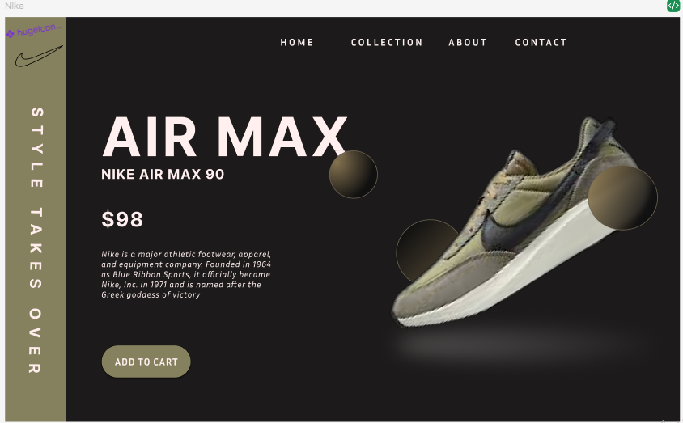

# Nike-Shoe-UI
Modern Nike shoe UI/UX concept created in Figma.
## Project Overview
This project is a clean and modern user interface for a Nike sneaker page. It focuses on an engaging product display, minimal layout, and smooth user experience - ideal for e-commerce or brand showcase.
## Tools Used
Figma - Used for UI/UX design, Layout Structuring, and prototyping.
## Files Included
'Nike-Shoe_UI.fig' - Main design file
'Preview.png' - Screenshot of design interface
## Design Preview 

## How to Use
1. Download the repository
2. Open the '.fig' file in [Figma](https://figma.com).
3. View and use freely this design.
   ## What I Learned
   This project helpy me improve my skills in:
   -Visual Balancing and spacing product in UI
   -Branding Consistency using Nike theme Colors
   -Wireframing and prototyping in Figma
## This Project is Licensed under the [MIT License] (LICENSE).
Designed by Zaigham Abbas.
